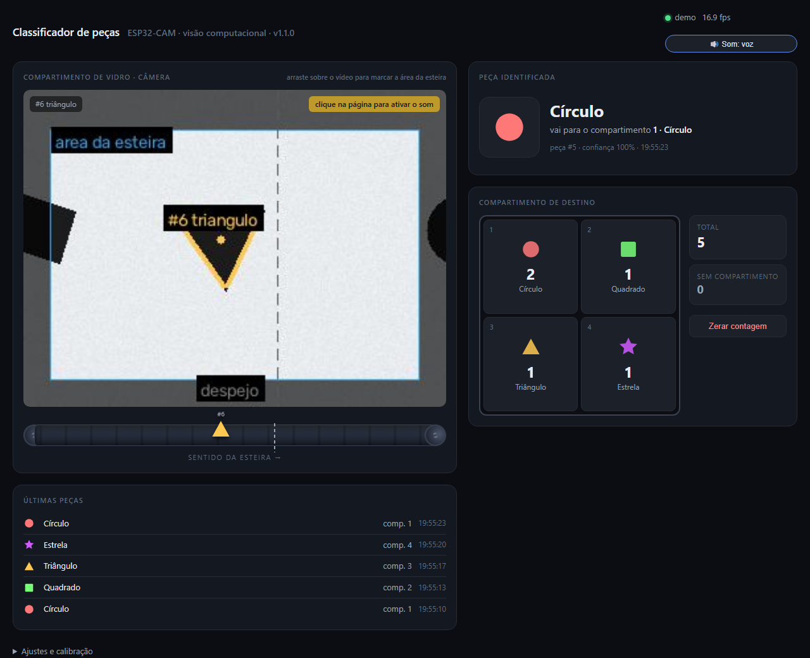

# Classificador de peças — ESP32-CAM

Sistema de visão computacional que identifica a **forma geométrica** das peças que
passam numa esteira (círculo, quadrado, triângulo, estrela) e mostra, em tempo real
numa página web, **em qual compartimento da caixa cada peça deve cair**.



A câmera é uma **ESP32-CAM (AI-Thinker)** ligada ao PC pelo cabo USB. A placa só
filma; quem reconhece as formas é o PC, com OpenCV. Não precisa de internet, Wi-Fi
nem de nenhum serviço externo.

```
 ESP32-CAM ──USB (921600 baud)──▶ PC: detecta + rastreia + conta ──▶ http://<ip>:8000
                                                                        │
                                             navegador do PC ◀──────────┤
                                             celular da banca ◀─────────┘
```

---

## 1. Instalação (para usar, sem programar)

### O que você precisa

- PC com **Windows 10 ou 11** (64 bits)
- A **ESP32-CAM** já com o firmware gravado (se não estiver, veja o item 5)
- Um cabo **USB de dados** (cabo só de carga não funciona)

### Passo a passo

1. Baixe o instalador:
   **[ClassificadorESP32CAM-Setup-1.0.0.exe](https://github.com/valmeidavr/esp32cam/releases/latest/download/ClassificadorESP32CAM-Setup-1.0.0.exe)**
   (página com todas as versões: [Releases](https://github.com/valmeidavr/esp32cam/releases))
2. Execute o instalador. O Windows pode mostrar o aviso *"o Windows protegeu o computador"*
   porque o programa não tem assinatura digital paga — clique em **Mais informações → Executar assim mesmo**.
3. Na tela de tarefas do instalador deixe marcado:
   - **Criar atalho na área de trabalho**
   - **Liberar a porta 8000 no firewall** — necessário para abrir a página pelo celular
4. Conclua. O instalador oferece abrir o programa em seguida.

O instalador já traz tudo dentro (Python, OpenCV, drivers da serial do Python).
Não é preciso instalar mais nada.

### Driver da placa (só se o Windows não reconhecer)

A ESP32-CAM usa o conversor USB **CH340**. Windows 10/11 costuma instalar o driver
sozinho ao conectar a placa. Se ela não aparecer no *Gerenciador de Dispositivos*
como `USB-SERIAL CH340 (COMx)`, instale o driver do fabricante — há um atalho
**"Driver USB CH340"** no menu Iniciar, ou baixe em
<https://www.wch.cn/downloads/CH341SER_EXE.html>.

---

## 2. Como usar

1. Ligue a ESP32-CAM ao PC pelo cabo USB.
2. Abra **Classificador de Peças ESP32-CAM** (atalho na área de trabalho).
3. Uma janela preta aparece, acha a placa sozinha e o navegador abre em
   `http://localhost:8000`. A janela também mostra o endereço para outros aparelhos,
   por exemplo:

   ```
   neste PC:          http://localhost:8000/
   outros aparelhos:  http://192.168.101.50:8000/   (celular, notebook da banca)
   ```
4. Para a banca acompanhar pelo celular, conecte o celular **no mesmo Wi-Fi do PC**
   e digite esse segundo endereço no navegador.
5. Deixe a janela preta aberta. Fechar a janela encerra o programa.

### O que aparece na página

| Área | O que mostra |
|---|---|
| **Compartimento de vidro · câmera** | A imagem ao vivo. Cada peça recebe um número (`#7 triangulo`) e um contorno colorido. A linha tracejada é a **linha de despejo**. |
| **Peça identificada** | A última peça que cruzou a linha, com a forma, o compartimento de destino e a confiança. |
| **Compartimento de destino** | A caixa 2×2. O quadrante **acende** quando uma peça é destinada a ele, e o contador sobe. |
| **Últimas peças** | Histórico com hora de cada peça. |
| **Ajustes** (no rodapé) | Posição da linha, modo de contagem, tamanho mínimo da peça, qualidade da imagem, flash da placa. |

### Para onde vai cada forma

| Forma detectada | Compartimento |
|---|---|
| círculo | **1 · Círculo** |
| quadrado | **2 · Quadrado** |
| triângulo | **3 · Triângulo** |
| estrela | **4 · Estrela** |
| retângulo, pentágono, hexágono, outros | *sem compartimento* (contado à parte) |

### Como a contagem funciona

Cada peça é **rastreada** enquanto atravessa a imagem e é contada **uma única vez**,
no momento em que cruza a linha de despejo. A forma que vale é a mais votada em
todos os quadros em que a peça apareceu — assim um quadro borrado não muda o
resultado.

Se na sua montagem a peça não chega a cruzar a linha (por exemplo, cai antes),
troque em *Ajustes → Contar a peça quando* para **"sair da imagem"**.

### Dicas para a apresentação

- **Fundo liso e claro** sob a câmera (papel branco) e peças **escuras** dão o melhor
  contraste. Evite sombras fortes.
- **Foco:** a lente da ESP32-CAM tem foco manual. Se a imagem estiver borrada, gire
  a lente com cuidado (ela tem rosca) até as bordas ficarem nítidas.
- **Distância:** a peça deve ocupar entre ~5 % e ~40 % da imagem. Peças muito
  pequenas são descartadas como ruído (ajuste *Tamanho mínimo da peça*).
- **Modo demonstração:** se a placa falhar na hora, abra o programa com `--demo`
  (menu Iniciar → botão direito → *Abrir local do arquivo*, e rode
  `ClassificadorESP32CAM.exe --demo` num terminal). Uma esteira simulada com peças
  desenhadas mostra o sistema inteiro funcionando.
- Se a placa reiniciar sozinha (LED piscando, imagem travando), a fonte USB está
  fraca: use outra porta USB ou um cabo mais curto.

---

## 3. Se algo der errado

| Sintoma | Causa provável | O que fazer |
|---|---|---|
| `nao achei nenhuma ESP32-CAM` | Cabo só de carga, ou driver CH340 ausente | Trocar o cabo; instalar o driver (item 1) |
| `A placa nao enviou nenhum quadro` | Firmware não gravado, câmera mal encaixada | Menu Iniciar → **Regravar firmware na placa**; reencaixar o flat da câmera |
| `Acesso negado` na porta COM | Outro programa usa a porta (Arduino IDE, monitor serial) | Fechar o outro programa |
| Celular não abre a página | Firewall, ou Wi-Fi diferente do PC | Reinstalar marcando *Liberar a porta 8000*; conferir o Wi-Fi |
| Página abre mas o vídeo não aparece | Placa desconectou | O programa reconecta sozinho em ~2 s; confira o cabo |
| Peças passam sem contar | Não cruzam a linha de despejo | Mover a linha em *Ajustes*, ou usar o modo "sair da imagem" |
| Círculo aparece como "polígono" | Imagem fora de foco ou peça muito pequena | Ajustar o foco da lente; aproximar a câmera |

---

## 4. Rodar a partir do código-fonte (desenvolvedores)

Requisitos: **Python 3.11+** e **Git**.

```powershell
git clone https://github.com/valmeidavr/esp32cam.git
cd esp32cam
python -m pip install -r visao\requirements.txt
python visao\app.py            # acha a placa e abre o navegador
python visao\app.py --demo     # sem a placa
```

Opções úteis: `--porta COM7` força a porta · `--http 8001` muda a porta web ·
`--so-local` desliga o acesso pela rede · `--sem-navegador`.

### Testar

Há uma suíte automatizada que não precisa da placa — ela desenha peças sintéticas,
simula a serial e sobe o servidor web num processo de teste:

```powershell
python -m pip install -r testes\requirements-dev.txt
python -m pytest                       # tudo (~6 s)
python -m pytest testes\test_detector.py -v      # só o detector, detalhado
```

| Arquivo | O que verifica |
|---|---|
| `test_detector.py` | Cada forma é reconhecida, inclusive girada; ruído e a moldura da imagem são ignorados |
| `test_rastreador.py` | Uma contagem por peça, compartimento certo, voto da maioria, modo "sair da imagem" |
| `test_ponte.py` | Decodificação dos quadros da serial, ressincronização após lixo, DTR/RTS baixos |
| `test_deteccao_porta.py` | Escolha da porta COM com 0, 1 ou várias placas |
| `test_app.py` | Servidor web completo sobre a esteira simulada: página, `/estado`, `/stream`, ajustes, zerar |
| `test_firmware.py` | O binário do firmware que vai no instalador está íntegro |

Os mesmos testes rodam no GitHub Actions a cada push (aba **Actions** do repositório).

**Com a placa ligada**, o roteiro manual é curto:

1. `python visao\app.py` → a janela deve dizer `ESP32-CAM encontrada: CH340 em COMx` e
   `camera respondendo`, e o navegador abrir com a imagem ao vivo a 15–20 fps.
2. Ponha uma peça escura sobre fundo claro na frente da câmera: ela ganha contorno e
   rótulo (`#1 circulo`) na imagem.
3. Arraste a peça da esquerda para a direita, cruzando a linha tracejada: o quadrante
   correspondente acende, o contador sobe **uma** vez e a peça entra em *Últimas peças*.
4. Puxe o cabo USB e ligue de novo: o LED do cabeçalho fica vermelho e volta a verde em
   ~2 s, sem reiniciar o programa.
5. Abra o endereço `http://<ip>:8000` no celular, no mesmo Wi-Fi: mesma página, mesmos números.

### Gerar o instalador

```powershell
python -m pip install pyinstaller pillow esptool
winget install JRSoftware.InnoSetup
powershell -ExecutionPolicy Bypass -File empacotar\construir.ps1
```

O resultado fica em `dist\ClassificadorESP32CAM-Setup-<versão>.exe`.

---

## 5. Firmware da ESP32-CAM

O firmware envia os quadros JPEG pela serial a 921600 baud, num formato simples
(marca `FRM`, tamanho, bytes do JPEG), e aceita três comandos de volta:
`R<n>` resolução · `Q<n>` qualidade · `L<0|1>` flash.

### Gravar sem instalar nada

O instalador traz o firmware pronto. No menu Iniciar → **Regravar firmware na placa**
(ou `ClassificadorESP32CAM.exe --gravar`). Com o shield *ESP32-CAM-MB* (a plaquinha
preta com USB) a gravação é automática. Na ESP32-CAM sem shield, ligue **GPIO0 ao GND**,
aperte RESET, grave, e depois solte o GPIO0.

### Compilar

Precisa do [PlatformIO](https://platformio.org/) (`python -m pip install platformio`):

```powershell
python -m platformio run --target upload     # compila e grava em COM3
```

A porta está fixa em `platformio.ini` (`upload_port = COM3`); ajuste se necessário.
Para atualizar o binário que vai dentro do instalador, gere o arquivo único:

```powershell
python -m esptool --chip esp32 merge-bin -o visao\firmware\esp32cam-formas.bin `
  --flash-mode dio --flash-freq 40m --flash-size 4MB `
  0x1000 .pio\build\esp32cam\bootloader.bin `
  0x8000 .pio\build\esp32cam\partitions.bin `
  0xe000 %USERPROFILE%\.platformio\packages\framework-arduinoespressif32\tools\partitions\boot_app0.bin `
  0x10000 .pio\build\esp32cam\firmware.bin
```

---

## 6. Como funciona por dentro

| Etapa | Onde | Como |
|---|---|---|
| Captura | `src/main.cpp` (ESP32) | OV2640 em 320×240 JPEG, ~18 fps pela serial |
| Leitura | `visao/ponte.py` | Sincroniza pela marca `FRM`, reconecta sozinho se o cabo cair |
| Detecção | `visao/detector.py` | Canny → contornos → `approxPolyDP`. Vértices dão triângulo/quadrado/pentágono/hexágono; circularidade dá o círculo; **solidez** (área ÷ envoltória convexa) dá a estrela |
| Rastreamento | `visao/rastreador.py` | Casa cada detecção com a peça mais próxima do quadro anterior; voto da maioria decide a forma; conta ao cruzar a linha |
| Interface | `visao/pagina.py` + `visao/app.py` | Servidor HTTP da biblioteca padrão; stream MJPEG em `/stream`, estado em `/estado` (JSON, consultado a cada 250 ms) |
| Instalador | `empacotar/` | PyInstaller (one-dir) + Inno Setup, com regra de firewall e atalhos |

### Estrutura do repositório

```
esp32cam/
├── platformio.ini          configuração da placa (ESP32-CAM AI-Thinker)
├── src/                    firmware
│   ├── main.cpp
│   └── camera_pins.h
├── visao/                  programa do PC
│   ├── app.py              ponto de entrada
│   ├── detector.py         classificação das formas
│   ├── rastreador.py       rastreamento e contagem
│   ├── ponte.py            leitura da serial
│   ├── deteccao_porta.py   acha a placa sozinho
│   ├── cena.py             desenho sobre o vídeo
│   ├── pagina.py           a página web
│   ├── fonte_demo.py       esteira simulada (--demo)
│   ├── gravador.py         regravação do firmware (--gravar)
│   ├── rede.py             IP na rede local
│   └── firmware/           binário pronto da placa
├── empacotar/              geração do instalador
│   ├── construir.ps1
│   ├── app.spec
│   ├── instalador.iss
│   └── gerar_icone.py
└── docs/
```
